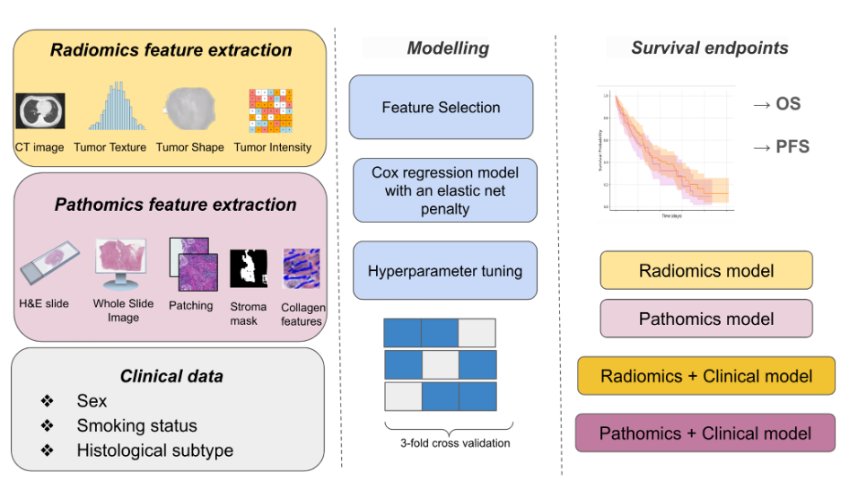

# CT-and-Whole-Slide-Image-Features-Predict-Clinical-Outcomes-in-Lung-Neuroendocrine-Patients



## Abstract
**Background**: Neuroendocrine tumors (NETs) are rare and heterogeneous cancers that vary in clinical presentation, biology, and treatment response. They exhibit slow growth with varying levels of aggressiveness, highlighting the need for reliable biomarkers to guide personalized treatment. This study aims to develop predictive models for overall survival (OS) and progression-free survival (PFS) using CT scans, whole slide images (WSIs) and clinical data. 

**Methods**: This retrospective analysis included 83 patients. Predictive models were developed using radiomics features from CT scans and morphological or pathomics features from whole slide images (WSIs). The Cox model was trained using the most significant features from both radiomics and pathomics. By integrating these features with clinical data, we built predictive models combining clinical-radiomics and clinical-pathomics information. We also assessed how image harmonization across different acquisition parameters affects model performance.

**Results**: The radiomics model's concordance indices (C-indices) for predicting OS and PFS in the validation cohort were 0.64 ± 0.06 and 0.60 ± 0.05, respectively. Combining radiomics with clinical data slightly improved performance, with C-indices of 0.643 ± 0.04 for OS and 0.61 ± 0.04 for PFS. For the pathomics model, combining morphological features with clinical data also showed slight improvements, with C-indices for OS rising from 0.60 ± 0.15 to 0.68 ± 0.08, and for PFS from 0.65 ± 0.08 to 0.70 ± 0.03. Harmonizing radiomics features did not significantly enhance the model's performance for predicting survival outcomes.

**Conclusion**: This study developed and validated models that integrate radiomics and pathomics with clinical data, improving prognostic accuracy for OS and PFS. These multimodal approaches, supported by large datasets, offer significant potential for enhancing patient risk stratification. Further multi-institutional validation is needed, but these imaging-driven biomarkers could ultimately refine therapeutic strategies and optimize survival outcomes.

---

## Environment & Installation
```bash
python -m venv .venv
source .venv/bin/activate  # Windows: .venv\Scripts\activate
pip install -r requirements.txt
```

### Requirements
Core dependencies are listed in `requirements.txt` (numpy, pandas, scikit-learn, scikit-survival, PyYAML, scipy).

---

## Data Expectations
- Survival time column: `"O.S. (2022)"` **or** `"PFS (2022)"`
- Vital status column: `"Vital status"` with values `Alive` / `Deceased`
- Clinical columns (used for early fusion): `sex`, `smoking_habit`, `Histological subtype 1_x`
- **CT features**: all feature columns appear **before** the last 9 columns (as in `train_ct_model.py`)
- **WSI features**: columns prefixed with `col*` (as in `train_wsi_model.py`)

> If your column names differ, adjust the arguments or config accordingly.

---

## Repository Layout

- `run_ct_model.py` — **3-fold** (and **multi-seed**) runner for CT
- `run_wsi_model.py` — **3-fold** (and **multi-seed**) runner for WSI
- `configs/config_ct.yaml` — sample CT config
- `configs/config_wsi.yaml` — sample WSI config (reference fields)

---

## Reproducing the 3-Fold Experiment

### Option A — Pure CLI
CT:
```bash
python run_ct_model.py   --input_file /path/to/ct.csv   --target_column "O.S. (2022)"   --vital_status_column "Vital status"   --clinical_features "age,sex,smoking_habit,Histological subtype 1_x"   --n_splits 3   --seed 42
```

WSI:
```bash
python run_wsi_model.py   --input_file /path/to/wsi.csv   --target_column "O.S. (2022)"   --vital_status_column "Vital status"   --clinical_features "age,sex,smoking_habit,Histological subtype 1_x"   --n_splits 3   --seed 42
```

### Option B — YAML Config (with CLI override)
Both runners accept `--config`:
```bash
python run_ct_model.py --config configs/config_ct.yaml
python run_wsi_model.py --config configs/config_wsi.yaml
```

---

## Multi-Seed 3-Fold Runs
Run multiple seeds in a single command (CLI or YAML). CLI overrides YAML.

**CLI:**
```bash
python run_ct_model.py --input_file /path/to/wsi.csv --seeds 1,2,3 --target_column "O.S. (2022)"
python run_wsi_model.py --input_file /path/to/wsi.csv --seeds 1,2,3 --target_column "O.S. (2022)"
```


---

## Outputs
Single-split scripts:
- `result_ct_<TARGET>.csv`, `result_wsi_<TARGET>.csv` — per-seed metrics

3-fold runners:
- `fold_results_ct_<TARGET>.csv` — columns: `seed`, `fold`, `cv_cindex_rad`, `test_cindex_rad`, `cv_cindex_clin`, `test_cindex_clin`
- `fold_summary_ct_<TARGET>.csv` — `mean ± std` of test C-index across seeds × folds (CT-only and CT+Clin)
- `fold_results_wsi_<TARGET>.csv` — columns: `seed`, `fold`, `cv_cindex_wsi`, `test_cindex_wsi`, `cv_cindex_wsi_clin`, `test_cindex_wsi_clin`
- `fold_summary_wsi_<TARGET>.csv` — `mean ± std` of test C-index across seeds × folds (WSI-only and WSI+Clin)

> `<TARGET>` is derived from the `target_column` (spaces and parentheses removed).


## Data Availability
The data presented in this study are not publicly available at this time but may be obtained from the corresponding author, **Venkata Manem**, upon reasonable request.

---

## Citation
If this work contributes to your research, please cite as follows:
```text
[Add your citation here]
```
